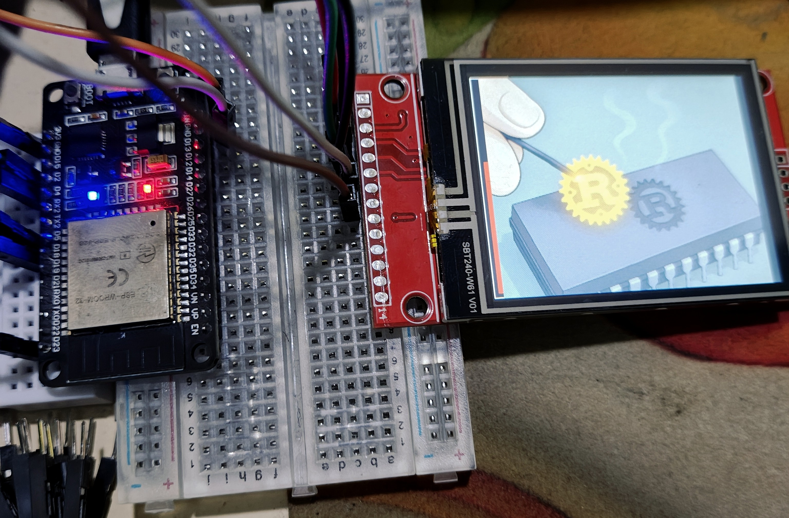

# TFT Image (Type 2)

This one uses the `mipidsi` crate

## Connections

> [!NOTE]
> Change `cs` pin from GPIO15 to GPIO5

## Image to be displayed

## Circuit

## Code file

[code](./src/bin/main.rs)
