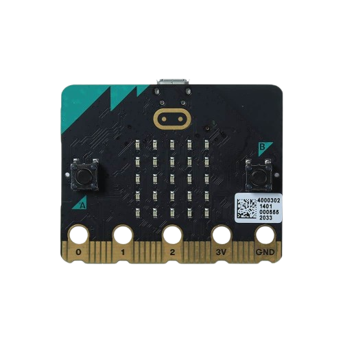
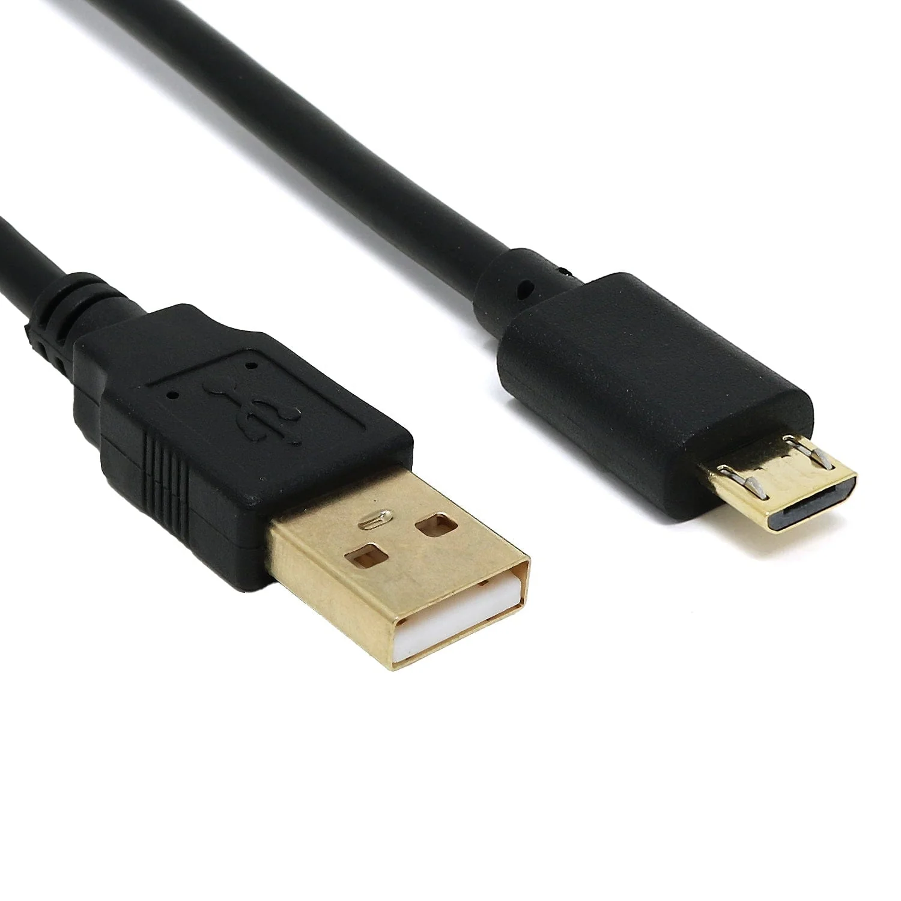

# Getting started

## Setting up the environment - 1

### Install Rust 

```bash 
curl --proto '=https' --tlsv1.2 -sSf https://sh.rustup.rs | sh
```

### Check if it is installed 

```bash +exec
rustc --version
```

<!--end_slide-->

## Setting up the environment - 2

### Adding the architecture

```bash +exec
rustup target add thumbv7em-none-eabihf
```

Check it with

```bash +exec
rustup show
```

<!--end_slide-->

## Setting up the environment - 3

### Installing `probe-rs`

After you have added the architecture, install `probe-rs` and `cargo-binutils` using the following commands

```bash
cargo install cargo-binutils

curl --proto '=https' --tlsv1.2 -LsSf https://github.com/probe-rs/probe-rs/releases/latest/download/probe-rs-tools-installer.sh | sh
```

<!--end_slide-->

## Usable Editors

1. Neovim
2. VSCode (With the below extensions installed)
    1. Rust-analyzer
    2. Even Better TOML
    3. Error Lens
    4. Crates

<!--end_slide-->

## Hardware Required 

Now with the software tools mostly installed, these are the hardware tools required

<!--column_layout: [2, 1]-->

<!--column: 0--> 

### BBC Microbit V2 

This is the microcontroller we will be using. 



<!--column: 1-->

### USB Cable

This is the USB cable that is given with the Microbit


