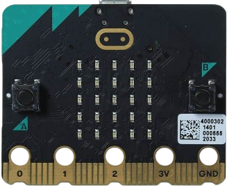
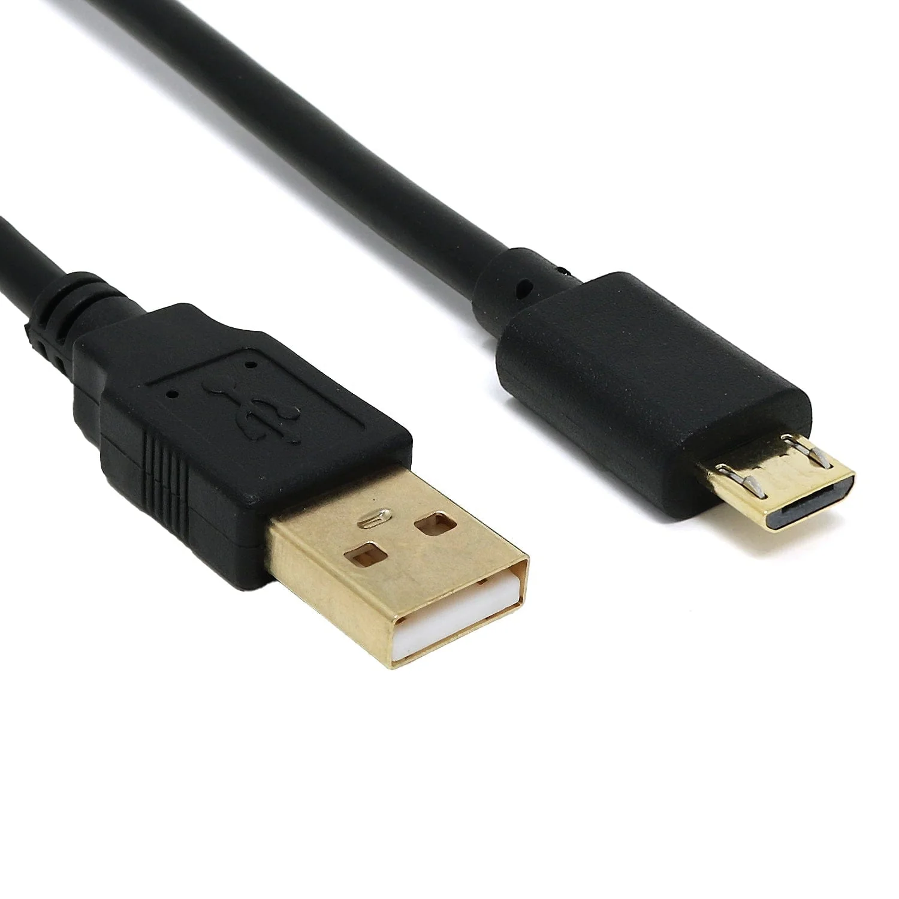
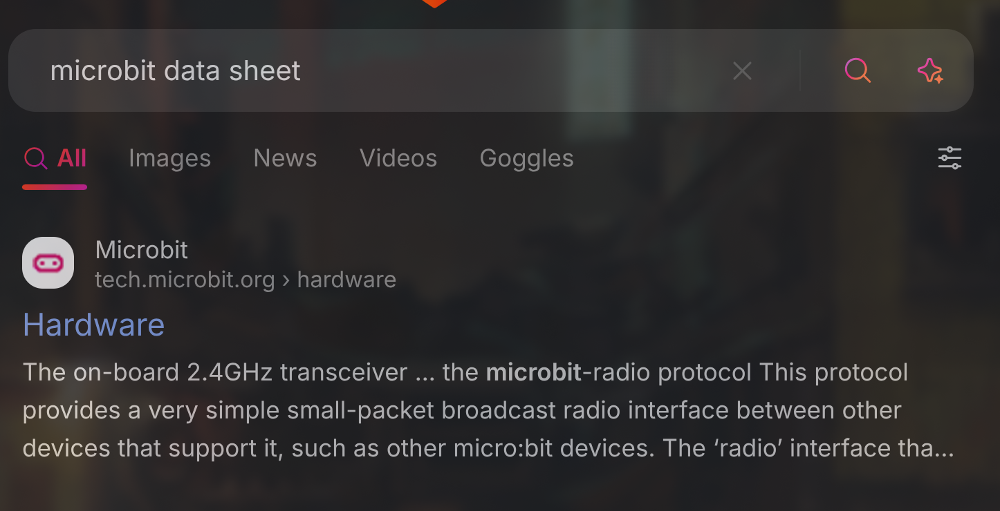
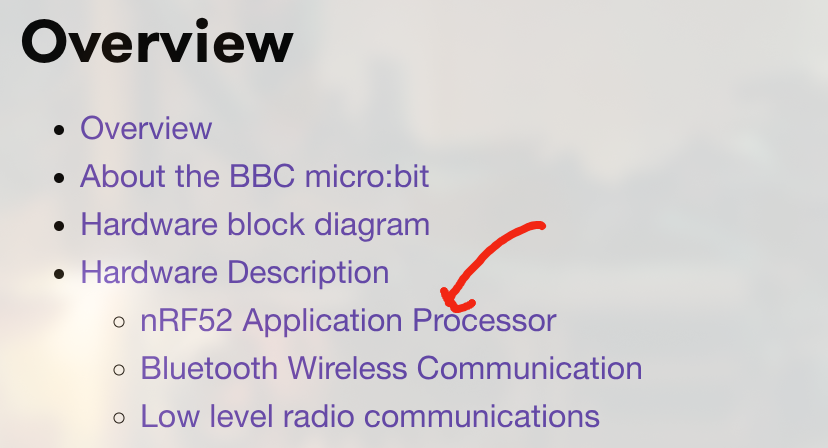
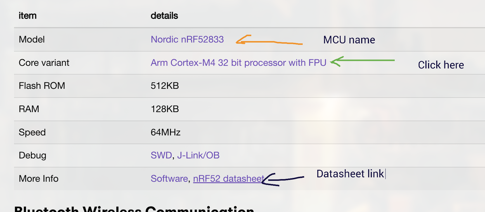
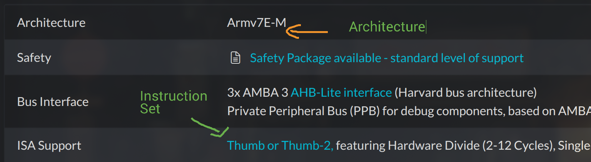

# Getting started

## Setting up the environment - 1

### Install Rust 

```bash 
curl --proto '=https' --tlsv1.2 -sSf https://sh.rustup.rs | sh
```

### Check if it is installed 

```bash +exec
rustc --version
```

<!--end_slide-->

## Setting up the environment - 2

Check it with

```bash +exec
rustup show
```

<!--end_slide-->

## Setting up the environment - 3

### Installing `probe-rs`

After you have added the architecture, install `probe-rs` and `cargo-binutils` using the following commands

```bash
cargo install cargo-binutils

curl --proto '=https' --tlsv1.2 -LsSf https://github.com/probe-rs/probe-rs/releases/latest/download/probe-rs-tools-installer.sh | sh
```

<!--end_slide-->

## Usable Editors

1. Neovim
2. VSCode (With the below extensions installed)
    1. Rust-analyzer
    2. Even Better TOML
    3. Error Lens
    4. Crates-io

<!--column_layout: [2, 1]-->

<!--column: 0-->


<!--column: 1-->


<!--reset_layout-->

<!--end_slide-->

## Hardware Required 

Now with the software tools mostly installed, these are the hardware tools required

<!--column_layout: [2, 1]-->

<!--column: 0--> 

### BBC Microbit V2 

This is the microcontroller we will be using. 



<!--column: 1-->

### USB Cable

This is the USB cable that is given with the Microbit



<!--reset_layout-->
<!--end_slide-->

## Compiler (Cross-compiler)

When we want to run Rust code on a microcontroller, we cannot use the same binary that is created when we build code for Rust in our host computer due to differences in architecture, sub-architecture, Vendors , OS and environment. 

### RUSTC/LLVM Target triple 

```bash
<arch><sub>-<vendor>-<sys>-<env>
```

- `arch` = x86_64, i386, arm ,.....
- `sub` = [ex. arm] v5, v6, v7, .....
- `vendor` = [optional] pc, apple, ibm,....
- `sys` = none, linux, win32, darwin, ..
- `env` = eabi, gnu, elf, ...

#### Example 

The LLVM target for the microbit-v2 board is 

```bash
thumbv7em-none-eabihf
```

<!--end_slide-->

## How to find out the architecture and llvm required - 1





<!--end_slide-->

## How to find out the architecture and llvm required - 2





<!--end_slide-->

## How to find out the architecture and llvm required - 3


<!--end_slide-->

## How to find out the architecture and llvm required - 4

Press `Ctrl + F` and search for `thumbv7em`

You'll get these 2 


We will choose the 2nd one with the hardfloat. i.e 

```bash
thumbv7em-none-eabihf
```

Then type 

```bash  +exec
rustup target add thumbv7em-none-eabihf
```

<!--end_slide-->

## Final Check 

```bash  +exec
rustup show
```

